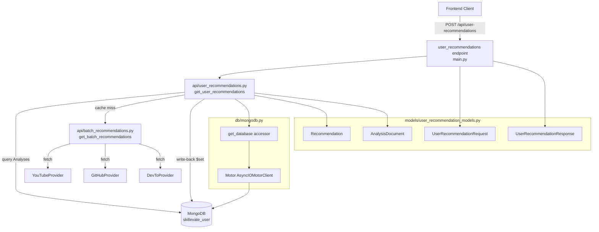
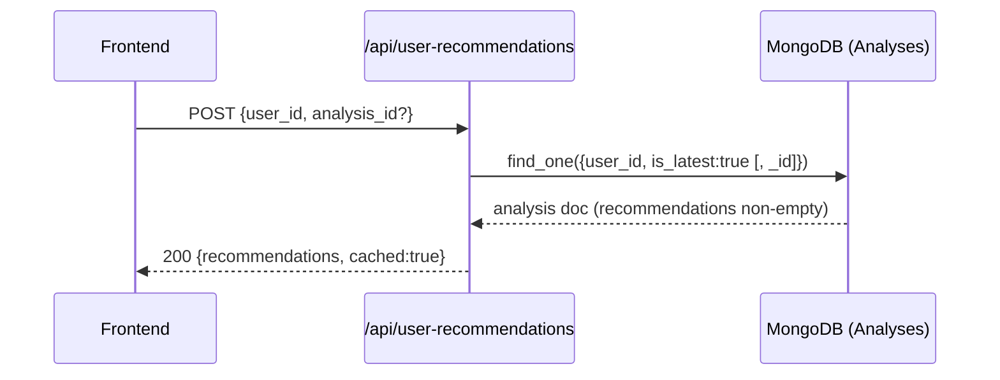
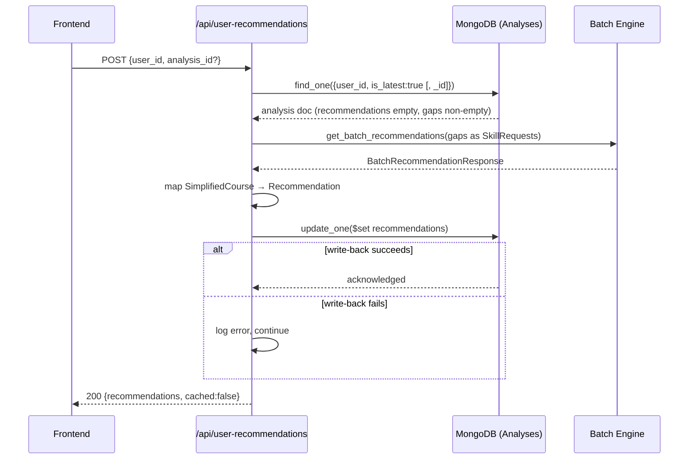

# Design Document: mongodb-recommendation-cache

## Overview

This feature adds a MongoDB-backed recommendation caching layer to the Skillevate Recommendation API. A new `POST /api/user-recommendations` endpoint orchestrates a check-then-generate-then-store flow: it queries the `Analyses` collection for an existing user analysis, returns cached recommendations immediately on a hit, or calls the internal batch engine and writes results back to MongoDB on a miss.

The design introduces three new modules (`db/mongodb.py`, `api/user_recommendations.py`, `models/user_recommendation_models.py`) and makes targeted modifications to `main.py` and `requirements.txt`. All new code is async-first, using Motor (the async MongoDB driver) to avoid blocking the FastAPI event loop.

### Key Design Decisions

| Decision | Choice | Rationale |
|---|---|---|
| MongoDB async driver | Motor (`motor[asyncio]`) | Non-blocking I/O; integrates cleanly with FastAPI's async handlers |
| Client lifecycle | FastAPI `lifespan` context manager | Replaces deprecated `on_event`; ensures clean startup/shutdown |
| Cache invalidation | Upstream workflow sets `is_latest=false` | No TTL needed; cache is invalidated by the analysis pipeline, not the API |
| Write-back failure | Log and return results anyway | User experience takes priority; stale cache is corrected on next miss |
| `xp_value` derivation | `round(relevance_score * 100)` | Simple, deterministic, no extra computation |
| `status` on creation | `"recommended"` | Matches the upstream data contract |
| CORS origins | `CORS_ORIGINS` env var, fallback `"*"` | Preserves existing behaviour; allows per-environment configuration |

---

## Architecture

### Component Diagram



### Module Responsibilities

| Module | Responsibility |
|---|---|
| `db/mongodb.py` | Motor client singleton, startup/shutdown hooks, `get_database()` accessor |
| `models/user_recommendation_models.py` | Pydantic models for request, response, `Recommendation`, `AnalysisDocument` |
| `api/user_recommendations.py` | Cache-check → generate → write-back → return orchestration logic |
| `main.py` (modified) | Register new endpoint, update CORS, add `lifespan` for MongoDB lifecycle |
| `requirements.txt` (modified) | Add `motor[asyncio]` and `pymongo` |

---

## Components and Interfaces

### `db/mongodb.py`

```python
# Module-level state
_client: AsyncIOMotorClient | None = None

async def connect_to_mongo() -> None:
    """
    Initialise the Motor client from MONGODB_URI.
    Raises RuntimeError if MONGODB_URI is not set or empty.
    Called once during application startup via lifespan.
    """

async def close_mongo_connection() -> None:
    """
    Close the Motor client gracefully.
    Called once during application shutdown via lifespan.
    """

def get_database() -> AsyncIOMotorDatabase:
    """
    Return the 'skillevate_user' database handle.
    Raises RuntimeError if called before connect_to_mongo().
    """
```

### `models/user_recommendation_models.py`

```python
class Recommendation(BaseModel):
    recommendation_id: str
    title: str
    provider: str
    url: str
    description: str
    tags: List[str] = []
    relevance_score: float = Field(ge=0.0, le=1.0)
    status: str
    xp_value: int = Field(ge=0, le=100)
    linked_gap: str

class AnalysisDocument(BaseModel):
    id: str = Field(alias="_id")          # ObjectId serialised as str
    user_id: str                           # ObjectId serialised as str
    is_latest: bool
    gaps: List[str] = []
    recommendations: List[Recommendation] = []

    model_config = ConfigDict(populate_by_name=True)

class UserRecommendationRequest(BaseModel):
    user_id: str = Field(
        ...,
        description="MongoDB ObjectId of the user (24-char hex string)",
        pattern=r"^[0-9a-fA-F]{24}$"
    )
    analysis_id: Optional[str] = Field(
        default=None,
        description="Optional MongoDB ObjectId of a specific analysis",
        pattern=r"^[0-9a-fA-F]{24}$"
    )

class UserRecommendationResponse(BaseModel):
    analysis_id: str
    user_id: str
    gaps: List[str]
    recommendations: List[Recommendation]
    cached: bool
```

### `api/user_recommendations.py`

```python
async def get_user_recommendations(
    request: UserRecommendationRequest,
) -> UserRecommendationResponse:
    """
    Orchestrate cache-check → generate → write-back → return.

    Raises:
        HTTPException(404): No active analysis found for user_id.
        HTTPException(502): Batch engine raised an unhandled exception.
    """

async def _fetch_active_analysis(
    db: AsyncIOMotorDatabase,
    user_id: str,
    analysis_id: Optional[str],
) -> dict | None:
    """
    Query Analyses collection for the active analysis document.
    Applies user_id + is_latest=True filter; optionally adds _id filter.
    Returns raw MongoDB document dict or None.
    """

def _map_courses_to_recommendations(
    skill_results: List[SkillRecommendationResult],
) -> List[Recommendation]:
    """
    Convert batch engine output to Recommendation objects.
    Sets status="recommended", xp_value=round(relevance_score * 100),
    linked_gap=skill (the gap string that produced the course).
    """

async def _write_back_recommendations(
    db: AsyncIOMotorDatabase,
    analysis_id: str,
    recommendations: List[Recommendation],
) -> None:
    """
    Atomically update Analyses document with $set on recommendations array.
    Logs and swallows any exception so the caller can still return results.
    """
```

### `main.py` changes

```python
# New lifespan context manager replaces on_event handlers
@asynccontextmanager
async def lifespan(app: FastAPI):
    await connect_to_mongo()
    yield
    await close_mongo_connection()

app = FastAPI(..., lifespan=lifespan)

# CORS origins from environment
cors_origins_raw = os.getenv("CORS_ORIGINS", "")
cors_origins = [o.strip() for o in cors_origins_raw.split(",") if o.strip()] or ["*"]

# New endpoint
@app.post("/api/user-recommendations", response_model=UserRecommendationResponse)
async def user_recommendations(request: UserRecommendationRequest):
    ...
```

---

## Data Models

### `Analyses` Collection Document Shape

```json
{
  "_id": ObjectId("..."),
  "user_id": ObjectId("..."),
  "is_latest": true,
  "results": {
    "gaps": ["Python async programming", "Docker containerisation"],
    "recommendations": [
      {
        "recommendation_id": "yt-abc123",
        "title": "Async Python Deep Dive",
        "provider": "YouTube",
        "url": "https://youtube.com/watch?v=abc123",
        "description": "...",
        "tags": ["python", "async", "asyncio"],
        "relevance_score": 0.87,
        "status": "recommended",
        "xp_value": 87,
        "linked_gap": "Python async programming"
      }
    ]
  }
}
```

> **Note on nesting:** The `gaps` and `recommendations` arrays live inside a `results` sub-document in the actual MongoDB schema. `AnalysisDocument` models this with a nested `results` field. The `_fetch_active_analysis` helper accesses `doc["results"]["gaps"]` and `doc["results"]["recommendations"]` accordingly.

### `xp_value` Derivation

```
xp_value = round(relevance_score * 100)
```

`relevance_score` is constrained to `[0.0, 1.0]` by the `SimplifiedCourse` model, so `xp_value` is always in `[0, 100]`.

### Recommended MongoDB Indexes

```javascript
// Primary lookup index — covers the cache-check query
db.Analyses.createIndex(
  { user_id: 1, is_latest: 1 },
  { name: "idx_user_is_latest" }
)

// Optional: supports analysis_id filter path
db.Analyses.createIndex(
  { _id: 1, user_id: 1, is_latest: 1 },
  { name: "idx_id_user_is_latest" }
)
```

The compound `(user_id, is_latest)` index is the critical one: it makes the cache-check query an index scan rather than a collection scan, which matters as the `Analyses` collection grows.

---

## Data Flow

### Cache-Hit Path



### Cache-Miss Path



### Error Paths

| Condition | Response |
|---|---|
| `MONGODB_URI` missing at startup | `RuntimeError` — app does not start |
| No active analysis found | HTTP 404 `"No active analysis found for this user"` |
| Active analysis found, gaps empty | HTTP 200, empty `recommendations`, `cached=false` |
| Batch engine exception | HTTP 502 `"Recommendation engine unavailable"` |
| MongoDB write-back failure | Log error, return results with `cached=false` (no error to caller) |
| Unhandled exception in endpoint | HTTP 500 with descriptive message + full traceback logged |

---

## Correctness Properties

*A property is a characteristic or behavior that should hold true across all valid executions of a system — essentially, a formal statement about what the system should do. Properties serve as the bridge between human-readable specifications and machine-verifiable correctness guarantees.*

### Property 1: ObjectId validation rejects invalid inputs

*For any* string that is not exactly 24 hexadecimal characters, constructing a `UserRecommendationRequest` with that string as `user_id` or `analysis_id` SHALL raise a `ValidationError`; conversely, any valid 24-character hex string SHALL be accepted without error.

**Validates: Requirements 3.1, 3.2**

---

### Property 2: xp_value derivation is correct and bounded

*For any* `relevance_score` in `[0.0, 1.0]`, the derived `xp_value` SHALL equal `round(relevance_score * 100)` and SHALL be in the integer range `[0, 100]`.

**Validates: Requirements 5.2**

---

### Property 3: Recommendation mapping is complete and correct

*For any* `BatchRecommendationResponse` containing N total `SimplifiedCourse` objects across all skill results, `_map_courses_to_recommendations` SHALL return exactly N `Recommendation` objects where each object has `status="recommended"`, `xp_value=round(relevance_score * 100)`, and `linked_gap` equal to the gap string that produced the course.

**Validates: Requirements 5.1, 5.2**

---

### Property 4: Cache-hit returns stored recommendations unchanged

*For any* active analysis document whose `recommendations` array is non-empty, the endpoint SHALL return those exact recommendations with `cached=true` and SHALL NOT call the batch engine.

**Validates: Requirements 4.4**

---

### Property 5: Cache-miss with non-empty gaps triggers generation

*For any* active analysis document whose `recommendations` array is empty and `gaps` array is non-empty, the endpoint SHALL call the batch engine with exactly one `SkillRequest` per gap string and return the mapped results with `cached=false`.

**Validates: Requirements 4.5, 5.1**

---

### Property 6: Recommendation round-trip serialisation preserves data

*For any* valid `Recommendation` object, serialising it to a dict (as stored in MongoDB) and deserialising it back SHALL produce an equivalent `Recommendation` object with all fields intact.

**Validates: Requirements 2.1**

---

### Property 7: Write-back failure does not block the user

*For any* set of generated recommendations, if the MongoDB write-back raises an exception, the endpoint SHALL still return HTTP 200 with the full recommendations list and `cached=false`, ensuring the user is never blocked by a storage failure.

**Validates: Requirements 5.5**

---

### Property 8: CORS origin parsing is correct

*For any* non-empty comma-separated list of origin URL strings in `CORS_ORIGINS`, the parsed origins list SHALL contain exactly the trimmed, non-empty strings from that list, with no duplicates introduced and no entries dropped.

**Validates: Requirements 7.1, 7.2**

---

## Error Handling

### Startup Errors

`connect_to_mongo()` reads `MONGODB_URI` from the environment. If the variable is absent or empty, it raises `RuntimeError("MONGODB_URI environment variable is not set or empty")` before the lifespan `yield`, which prevents the application from accepting requests.

### Request Validation Errors

Pydantic's `pattern` constraint on `user_id` and `analysis_id` fields causes FastAPI to return HTTP 422 automatically with a structured validation error body. No custom exception handler is needed.

### Not Found

`_fetch_active_analysis` returns `None` when no matching document exists. The endpoint handler raises `HTTPException(status_code=404, detail="No active analysis found for this user")`.

### Batch Engine Errors

The batch engine call is wrapped in a `try/except Exception`. On failure, the handler logs the full traceback and raises `HTTPException(status_code=502, detail="Recommendation engine unavailable")`.

### Write-Back Errors

`_write_back_recommendations` wraps the Motor `update_one` call in a `try/except Exception`. On failure it logs the error at `ERROR` level and returns normally, allowing the caller to proceed with returning results to the user.

### Unhandled Exceptions

The endpoint handler has a top-level `try/except Exception` that logs the full traceback and raises `HTTPException(status_code=500, detail=str(e))`.

---

## Testing Strategy

### Unit Tests

Focus on pure logic that can be tested without a live MongoDB instance:

- `_map_courses_to_recommendations`: verify field mapping, `xp_value` derivation, `linked_gap` assignment, `status` value.
- `UserRecommendationRequest` validation: valid ObjectIds accepted, invalid strings rejected with `ValidationError`.
- `Recommendation` model: `relevance_score` outside `[0.0, 1.0]` raises `ValidationError`.
- CORS origin parsing: `CORS_ORIGINS` env var correctly split and applied; fallback to `"*"` when unset.

### Property-Based Tests

Use **Hypothesis** (the standard Python PBT library) with a minimum of 100 iterations per property.

Each test is tagged with a comment in the format:
`# Feature: mongodb-recommendation-cache, Property N: <property_text>`

| Property | Test Strategy |
|---|---|
| P1: ObjectId validation | Generate arbitrary strings; assert valid 24-hex strings pass, all others raise `ValidationError` |
| P2: xp_value derivation | Generate floats in `[0.0, 1.0]`; assert `xp_value == round(score * 100)` and `0 <= xp_value <= 100` |
| P3: Recommendation mapping | Generate lists of `SimplifiedCourse` objects with gap labels; assert output length, `status`, `linked_gap`, `xp_value` |
| P4: Cache-hit path | Generate non-empty `Recommendation` lists; mock MongoDB; assert `cached=true` and batch engine not called |
| P5: Cache-miss path | Generate non-empty gap lists; mock MongoDB with empty recommendations; assert batch engine called with correct `SkillRequest` count |
| P6: Round-trip serialisation | Generate `Recommendation` objects; assert `Recommendation(**rec.model_dump()) == rec` |
| P7: Write-back failure resilience | Generate recommendation lists; mock `update_one` to raise; assert HTTP 200 with full results |
| P8: CORS origin parsing | Generate lists of URL strings; assert parsed origins match input exactly |

### Integration Tests

Use a real (or `mongomock`-backed) MongoDB instance:

- Cache-hit path: pre-populate `Analyses` with non-empty `recommendations`; assert `cached=true` and no batch engine call.
- Cache-miss path: pre-populate `Analyses` with empty `recommendations` and non-empty `gaps`; assert write-back occurred and `cached=false`.
- Write-back failure resilience: mock Motor `update_one` to raise; assert HTTP 200 still returned.
- 404 path: query with unknown `user_id`; assert HTTP 404.
- 502 path: mock batch engine to raise; assert HTTP 502.

### Smoke Tests

- Application starts without error when `MONGODB_URI` is set.
- Application raises `RuntimeError` at startup when `MONGODB_URI` is absent.
